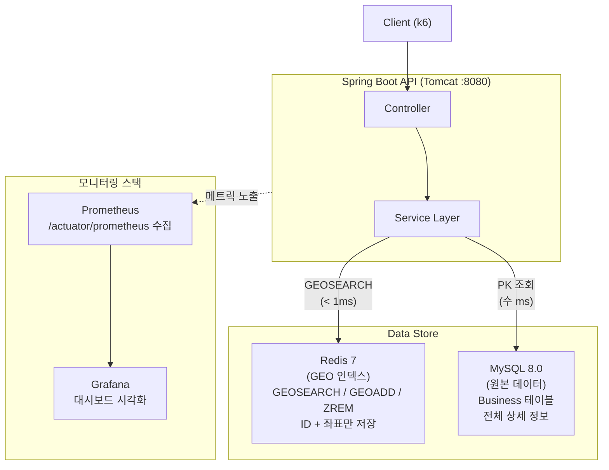
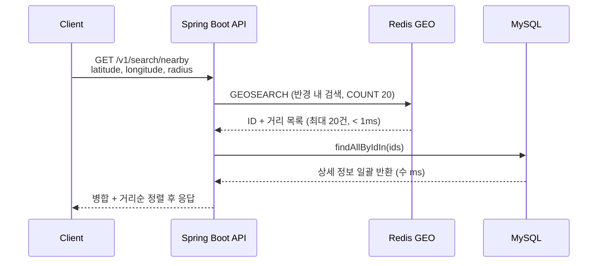
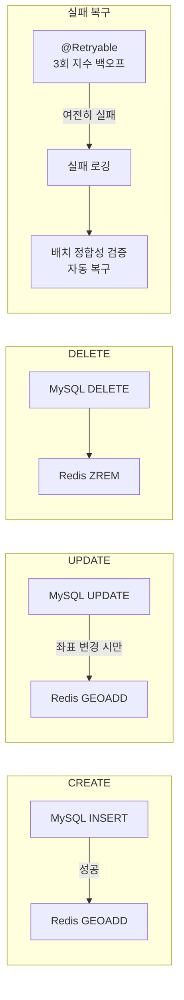

# Proximity Service — 대규모 시스템 설계 케이스 스터디

『가상 면접 사례로 배우는 대규모 시스템 설계 기초 2』 1장 **Proximity Service**를 직접 구현하고, 부하 테스트를 통해 설계 원칙의 필요성을 검증한 프로젝트.

## 프로젝트 개요

| 항목 | 내용 |
|------|------|
| **책 참고** | 가상 면접 사례로 배우는 대규모 시스템 설계 기초 2, 1장 |
| **핵심 기능** | 위치 기반 주변 사업장 검색 (Proximity Search) |
| **기술 스택** | Java 21, Spring Boot 3.4.1, MySQL 8.0, Redis 7 |
| **모니터링** | Prometheus + Grafana + k6 |
| **인프라** | Docker Compose (로컬) |

## 아키텍처

### 전체 시스템 구조



### 검색 요청 흐름 (2단계 조회)



### CRUD 동기화 흐름



### 책의 설계 원칙 적용

| 원칙 | 구현 |
|------|------|
| **읽기/쓰기 분리** | Redis GEO = 읽기 전용 인덱스, MySQL = 원본 데이터 |
| **데이터 지역성** | Redis에 ID+좌표만 저장, 상세 정보는 MySQL PK 조회 |
| **검색 결과 제한** | GEOSEARCH COUNT로 최대 20건 반환 (페이지네이션) |
| **앱 레벨 동기화** | CRUD 시 MySQL + Redis 동시 갱신 |
| **배치 복구** | 전체 동기화 + 정합성 검증 배치 |

## 왜 이 구조가 최선인가

### 1. Redis GEO + MySQL 이중 저장소 — 왜 DB 하나로 안 되는가

**MySQL만 사용하는 경우:**

```sql
-- 반경 검색을 SQL로 하면
SELECT *, ST_Distance_Sphere(POINT(lng, lat), POINT(?, ?)) AS dist
FROM business
WHERE ST_Distance_Sphere(POINT(lng, lat), POINT(?, ?)) < 5000
ORDER BY dist LIMIT 20;
```

이 쿼리는 **풀 테이블 스캔**이다. 공간 인덱스(R-Tree)를 써도 10만 건 이상에서 수십~수백 ms가 걸린다. Redis GEO는 같은 연산을 **1ms 미만**에 처리한다.

**Redis만 사용하는 경우:**

Redis GEO는 좌표와 키(ID)만 저장할 수 있다. 사업장 이름, 주소, 전화번호 같은 상세 정보를 저장하려면 별도 Hash로 관리해야 하는데, 그러면 Redis가 **영속성 없는 단일 장애점**이 된다.

**결론:** 각 저장소의 강점만 활용하는 것이 최선이다.

| 역할 | Redis GEO | MySQL |
|------|-----------|-------|
| 지리 검색 | O (< 1ms, Geohash) | X (풀스캔 또는 느린 공간 인덱스) |
| 상세 데이터 저장 | X (키-값만 가능) | O (정규화된 스키마) |
| 영속성 | △ (AOF/RDB, 복구 느림) | O (트랜잭션, WAL) |
| 데이터 정합성 | X (단일 키 연산) | O (ACID) |

### 2. 앱 레벨 동기화 — 왜 분산 트랜잭션을 안 쓰는가

MySQL과 Redis를 동시에 갱신할 때 세 가지 선택지가 있다:

| 방식 | 장점 | 단점 |
|------|------|------|
| **분산 트랜잭션 (2PC)** | 완벽한 정합성 | 성능 저하 심각, 구현 복잡, Redis는 2PC 미지원 |
| **CDC (Change Data Capture)** | 느슨한 결합 | Debezium 등 인프라 추가 필요, 운영 복잡도 증가 |
| **앱 레벨 동기화** | 단순, 빠름, 디버깅 쉬움 | 일시적 불일치 가능 |

이 프로젝트에서 앱 레벨 동기화가 최선인 이유:

1. **검색 인덱스는 최종 일관성으로 충분하다** — 사업장 정보가 1~2초 늦게 검색에 반영되어도 서비스에 영향 없음
2. **실패 시 복구 경로가 명확하다** — `@Retryable`(3회 재시도) → 실패 로깅 → 배치 정합성 검증으로 자동 복구
3. **인프라 의존성을 최소화한다** — Debezium, Kafka 같은 추가 컴포넌트 없이 Spring Boot만으로 완결

### 3. 2단계 조회 — 왜 Redis에서 한 번에 안 가져오는가

Redis에 상세 정보까지 저장하면(Hash + GEO) 한 번의 호출로 끝난다. 하지만:

- **메모리 비용**: 2억 건 × (ID+좌표+이름+주소+전화번호+...) = 수백 GB → 비현실적
- **Redis에 ID+좌표만 저장**: 2억 건 × ~100 bytes = ~20 GB → 현실적

2단계 조회의 추가 비용은 MySQL PK 조회 20건(IN 쿼리)으로 **수 ms**에 불과하다. 메모리 수백 GB를 절약하는 대가로 수 ms를 지불하는 것은 합리적인 트레이드오프다.

### 4. 결과 제한 (COUNT 20) — 부하 테스트가 증명한 필수 설계

이론이 아니라 **실제 장애로 검증된 결론**이다:

```
COUNT 없음: 반경 내 수만 건 반환 → 응답 2MB → p95 41초 → 서비스 불가
COUNT 20:   최대 20건 반환      → 응답 수 KB → p95 2.1초 → 20배 개선
```

클라이언트 관점에서도 수만 건의 검색 결과는 의미가 없다. 가장 가까운 20건이면 충분하며, 이는 Google Maps 등 실제 서비스의 동작 방식과 동일하다.

### 5. 로컬 단일 인스턴스의 현실적 한계

현재 p95 2.1초는 아키텍처의 문제가 아니라 **로컬 Docker 환경의 물리적 한계**다:

| 병목 | 원인 | 해결 (단일 PC에서 불가) |
|------|------|----------------------|
| CPU 경합 | App + MySQL + Redis가 같은 CPU 공유 | 별도 서버 분리 |
| 메모리 경합 | JVM + MySQL 버퍼풀 + Redis가 같은 RAM 공유 | 서버별 전용 메모리 |
| 디스크 I/O | MySQL WAL + Redis AOF가 같은 디스크 경합 | SSD 분리 또는 네트워크 스토리지 |
| 네트워크 | Docker 브리지 네트워크 오버헤드 | 물리 네트워크 |

**같은 PC에서 MySQL 읽기 복제본을 추가해도 의미가 없다.** 하드웨어 자원을 나눠 쓰는 것이므로 오히려 복제 오버헤드만 증가한다. 현재 구조에서 단일 머신의 성능은 이미 최적에 가깝다.

### 6. 추가 확장이 필요할 때 (별도 하드웨어 전제)

| 단계 | 전략 | 기대 효과 | 현재 코드 변경 |
|------|------|----------|--------------|
| 1단계 | 수평 확장 (Nginx + App 멀티 인스턴스) | 동시 처리 능력 N배 | 없음 (Stateless 설계) |
| 2단계 | MySQL 읽기 복제본 분리 | DB 읽기 병목 해소 | DataSource 라우팅 추가 |
| 3단계 | Redis Cluster (지역별 샤딩) | 2억 건 분산 | Redis 설정 변경 |
| 4단계 | 응답 캐싱 (동일 지역 반복 검색) | 같은 위치 재검색 시 즉시 응답 | 캐시 레이어 추가 |

현재 애플리케이션이 **Stateless**로 설계되어 있으므로 1단계 수평 확장은 코드 변경 없이 가능하다.

## 구현 Phase

| Phase | 브랜치 | 설명 |
|-------|--------|------|
| 1 | `001-nearby-search-api` | Redis GEO 기반 주변 검색 API |
| 2 | `002-business-crud-api` | 사업장 CRUD API + 앱 레벨 Redis 동기화 |
| 3 | `003-sync-recovery-batch` | 전체 동기화 + 정합성 검증 배치 |
| 4 | `004-verification-performance-e2e-tests` | 설계 원칙 검증 + 성능 + E2E 테스트 |
| 5 | `005-k6-load-test-visualization` | k6 부하 테스트 + Prometheus/Grafana 모니터링 |
| 6 | `006-performance-optimization` | 검색 페이지네이션 + DB 커넥션 풀 튜닝 |

## 부하 테스트 결과 & 실패에서 배운 것

이 프로젝트의 핵심 학습은 **소규모에서 잘 동작하는 코드가 대규모에서 무너지는 과정**을 직접 경험한 것이다.

### 책의 요구 규모

| 항목 | 수치 |
|------|------|
| 사업장 수 | 2억 건 |
| DAU | 1억 명 |
| 평균 QPS | 5,800 |
| 응답 시간 | 100ms 이내 |

### 테스트 1: 소규모 (1,000건, 50 VU) — 모두 통과

| 테스트 | p95 | RPS | 에러율 |
|--------|-----|-----|--------|
| nearby-search | 11ms | 326 | 0% |
| crud-mixed | 13ms | 161 | 0.05% |

소규모에서는 아무 문제가 없었다. 모든 성능 기준을 여유 있게 통과했다.

### 테스트 2: 대규모 (100,000건, 500 VU) — 완전 실패

| 테스트 | p95 | RPS | 에러율 |
|--------|-----|-----|--------|
| nearby-search | **41초** | 10 | 0% |
| crud-mixed | **60초** (타임아웃) | 4 | **29%** |

시스템이 완전히 무너졌다. 원인 분석:

#### 실패 원인 1: 검색 결과 수 제한 없음 (가장 치명적)

```
1,000건 → 반경 5km 내 수십 건 → 응답 수 KB → 문제없음
100,000건 → 반경 5km 내 수만 건 → 응답 2MB → 서버 마비
```

Redis GEOSEARCH가 반경 내 모든 결과를 반환하고, 그 전부를 MySQL에서 조회하여 응답에 포함했다. 요청 하나당 2MB 응답은 서버가 감당할 수 없었다.

#### 실패 원인 2: DB 커넥션 풀 고갈

HikariCP 기본 풀(10개)로 500 VU를 감당할 수 없었다. 각 요청이 수만 건을 처리하느라 커넥션을 오래 점유하면서 대기 큐가 폭발했다.

#### 실패 원인 3: 단일 서버 스레드 포화

톰캣 기본 스레드(200개)로 500 VU의 동시 요청을 처리할 수 없었다. 각 요청의 처리 시간이 길어지면서 스레드 반환이 느려지고 전체가 밀렸다.

### 테스트 3: 개선 후 (100,000건, 500 VU) — 대폭 개선

**적용한 개선:**
1. GEOSEARCH COUNT 옵션으로 검색 결과 최대 20건 제한
2. HikariCP 커넥션 풀 10 → 50으로 확대

| 테스트 | p95 | RPS | 에러율 | 변화 |
|--------|-----|-----|--------|------|
| nearby-search | **2.1초** | 155 | 0% | p95 20배 개선 |
| crud-mixed | **2.08초** | 81 | **0.10%** | 에러율 29%→0.1% |

**검색 결과 제한 하나**로 응답 크기가 2MB → 수 KB로 줄었고, 대부분의 성능 문제가 해소되었다.

### 아직 남은 과제

p95 100ms 목표는 여전히 미달(2.1초). 이는 아키텍처의 문제가 아니라 로컬 Docker 단일 인스턴스의 물리적 한계다. 상세한 분석과 확장 전략은 [왜 이 구조가 최선인가](#왜-이-구조가-최선인가) 섹션을 참고.

## 빠른 시작

### 전체 스택 실행

```bash
docker compose up -d
```

### 부하 테스트 실행

```bash
# 주변 검색 부하 테스트
docker compose --profile test run --rm k6 run --out experimental-prometheus-rw /scripts/nearby-search.js

# CRUD 혼합 부하 테스트
docker compose --profile test run --rm k6 run --out experimental-prometheus-rw /scripts/crud-mixed.js
```

### 모니터링 확인

| 서비스 | URL |
|--------|-----|
| Grafana 대시보드 | http://localhost:3000 |
| Prometheus | http://localhost:9090 |
| API | http://localhost:8080 |

### 유닛 테스트

```bash
./gradlew test
```

### 종료

```bash
docker compose down -v
```

## API 엔드포인트

| Method | Path | 설명 |
|--------|------|------|
| GET | `/v1/search/nearby?latitude=&longitude=&radius=&limit=` | 주변 검색 |
| POST | `/v1/businesses` | 사업장 등록 |
| GET | `/v1/businesses/{id}` | 사업장 조회 |
| PUT | `/v1/businesses/{id}` | 사업장 수정 |
| DELETE | `/v1/businesses/{id}` | 사업장 삭제 |
| POST | `/v1/businesses/seed` | 대량 시딩 |

## 프로젝트 구조

```
src/main/java/com/proximityservice/
├── controller/         # REST API 컨트롤러
├── service/            # 비즈니스 로직
├── repository/         # MySQL JPA + Redis GEO
├── domain/             # JPA 엔티티
├── dto/                # 요청/응답 DTO
├── config/             # Redis 설정
├── batch/              # 동기화/정합성 배치
└── exception/          # 예외 처리

k6/scripts/             # k6 부하 테스트 스크립트
monitoring/             # Prometheus + Grafana 설정
specs/                  # 설계 문서 (Phase별)
```
